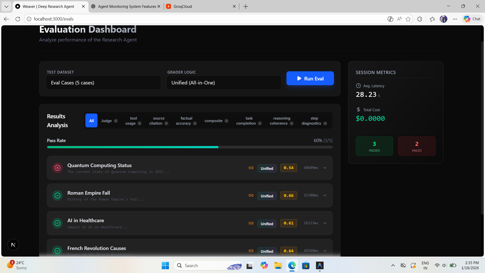
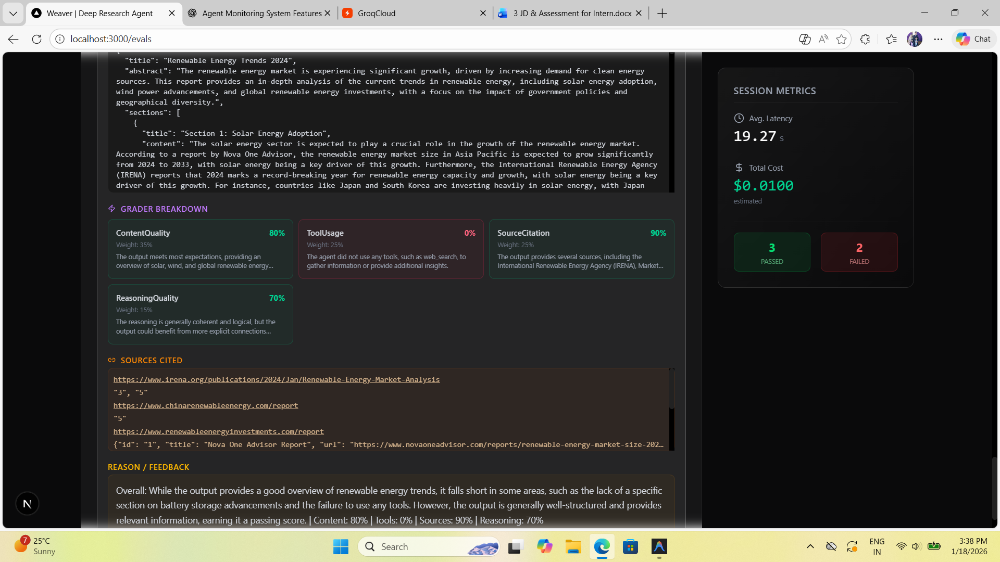
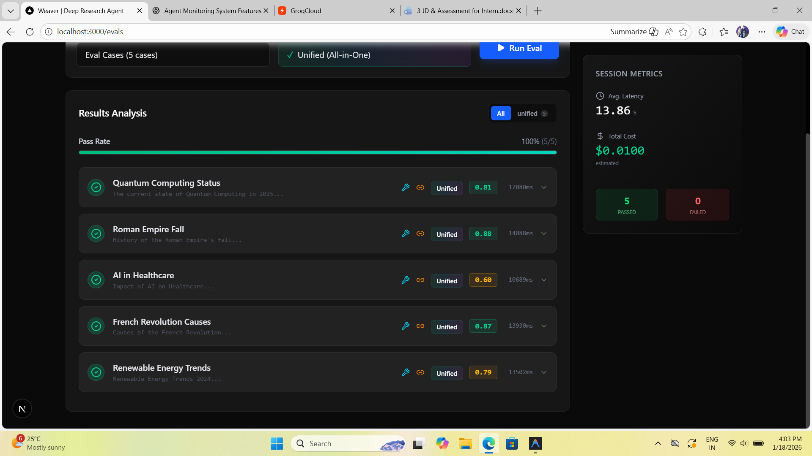

# Weaver - Multi-Agent Research Assistant

**Weaver** is an intelligent, self-correcting multi-agent research application designed to produce high-quality, verified research reports. By orchestrating a team of specialized AI agents, Weaver automates the process of gathering information, critiquing content for accuracy, and revising drafts to ensure comprehensive and reliable outputs.


---

## 🚀 Features

-   **Multi-Agent Architecture**: Uses a specialized team of agents (Researcher, Critic, Reviser) to iteratively improve output quality.
    -   **Researcher**: Gathers data from the web using advanced search tools.
    -   **Critic**: Reviews the research for gaps, bias, and accuracy.
    -   **Reviser**: Polishes the final output based on feedback.
-   **Smart Web Search**: Integrates with Tavily and SerpAPI for real-time, accurate information retrieval.
-   **Self-Correction**: The system automatically evaluates its own work and performs improved search iterations.
-   **Modern User Interface**: Built with Next.js 16, Tailwind CSS, and Framer Motion for a smooth, responsive experience.
-   **Robust Backend**: Powered by FastAPI and Groq's high-performance LLMs (e.g., Qwen 2.5).
-   **Evaluation Framework**: Includes comprehensive evaluation routes to benchmark agent performance.

---

## 🏗️ Architecture

Weaver follows a decoupled client-server architecture:

### **Backend (App)**
-   **Framework**: FastAPI (Python).
-   **LLM Provider**: Groq (high-speed inference).
-   **Database**: Supabase (PostgreSQL) for persistence.
-   **Vector Search**: Qdrant (for RAG capabilities).
-   **Containerization**: Dockerized for consistent deployment.
-   **Hosting**: Render (Web Service).

### **Frontend**
-   **Framework**: Next.js 16 (App Router).
-   **Styling**: Tailwind CSS v4.
-   **State/Anim**: React 19, Framer Motion.
-   **Hosting**: Vercel.

---

## 🛠️ Tech Stack

### Core
-   **Language**: Python 3.11 (Backend), TypeScript (Frontend)
-   **Orchestration**: Custom Agent Orchestrator
-   **LLM**: Groq API

### Infrastructure
-   **Database**: Supabase
-   **Deployment**: Vercel (Frontend), Render (Backend)
-   **Containerization**: Docker

### Tools & Libraries
-   **Backend**: `fastapi`, `uvicorn`, `pydantic`, `supabase`, `tavily-python`
-   **Frontend**: `next`, `react`, `lucide-react`, `framer-motion`

---

## 🏁 Getting Started

### Prerequisites
-   Python 3.11+
-   Node.js 18+
-   Docker (optional, for containerized run)
-   Accounts for: Groq, Supabase, Tavily (optional)

### 1. Clone the Repository
```bash
git clone https://github.com/yourusername/weaver.git
cd weaver
```

### 2. Environment Setup

**Backend:**
Create a `.env` file in the root directory based on `.env.example`:
```bash
cp .env.example .env
```
Update the following keys:
-   `SUPABASE_URL`, `SUPABASE_KEY`
-   `GROQ_API_KEY`
-   `TAVILY_API_KEY` (for search capabilities)

**Frontend:**
Navigate to `frontend/` and create a `.env.local` file:
```bash
cd frontend
cp .env.example .env.local
```

### 3. Running Locally

**Backend (Python):**
```bash
# From the root directory
python -m venv venv
source venv/bin/activate  # or venv\Scripts\activate on Windows
pip install -r requirements.txt
uvicorn app.api.routes:app --reload
```
*The backend will be available at `http://localhost:8000`.*

**Frontend (Next.js):**
```bash
cd frontend
npm install
npm run dev
```
*The frontend will be available at `http://localhost:3000`.*

### 4. Running with Docker
```bash
docker build -t weaver-backend .
docker run -p 8000:8000 --env-file .env weaver-backend
```

---

## 🧠 Challenges & Learnings

During the development of Weave, we encountered and overcame several key challenges:

1.  **RAG & Vector Search Validation**:
    -   *Challenge*: Ensuring consistent retrieval accuracy across different embedding models and vector stores (Qdrant/Supabase).
    -   *Solution*: Implemented rigorous validation scripts and evaluation routes (`/eval`) to verify retriever performance and reranking logic.

2.  **Deployment on Free Tier Services**:
    -   *Challenge*: Deploying the backend on Render's free tier resulted in "cold starts," causing initial requests to time out or fail.
    -   *Solution*: Added a user-facing warning system in the frontend to inform users about potential delays, improving the UX despite infrastructure limitations.

3.  **Frontend Build & Module Resolution**:
    -   *Challenge*: Complex path aliases and module imports caused Vercel build failures.
    -   *Solution*: Standardized the project structure and refined `tsconfig.json` and `next.config.ts` to ensure consistent module resolution across local and cloud environments.

4.  **Agent Orchestration**:
    -   *Challenge*: Coordinating multiple agents (Researcher -> Critic -> Reviser) to produce deterministic and high-quality results without infinite loops.
    -   *Solution*: Designed a robust Orchestrator pattern with strict state management and timeout safeguards.

---

## 🧪 Evaluation Pipeline

Weaver includes a comprehensive evaluation framework to ensure agent reliability and accuracy. The system rigorously tests the research agent against a set of predefined cases (`eval_cases.json`).

### 📊 Dashboard Overview
The Evaluation Dashboard provides a real-time view of the agent's performance. The example below highlights an initial run where **tool usage was disabled**, resulting in a lower pass rate (3/5).


*Figure 1: Dashboard snapshot showing 2 failures due to lack of tool integration.*

### 🔍 Detailed Grader Breakdown
Each research report is graded on multiple dimensions using a "Unified" grader logic:
-   **Content Quality**: Depth and relevance of the information.
-   **Source Citation**: Accuracy and frequency of citations.
-   **Reasoning Quality**: Logical flow and coherence.
-   **Tool Usage**: Effective use of search and generic tools.

In the breakdown below, observe how the **0% Tool Usage** score negatively impacted the overall grade, highlighting the importance of agentic tool access.


*Figure 2: Specific test case showing a 0% Tool Usage score, leading to a "Failed" status despite decent content quality.*

### 📈 Result Analysis
The system tracks historical performance to identify regressions. As shown in the final results below, **enabling tool usage** significantly improved validity, achieving a **100% pass rate** across all test cases.


*Figure 3: Improved results showing 5/5 Passed cases after correcting tool integration.*

### HOW IT WORKS
1.  **Dataset Definition**: Test cases are defined in `eval_cases.json`.
2.  **Execution**: The `runner.py` executes the agent against these cases.
3.  **Grading**: The `evaluator.py` compares the output against ground truth (if available) or uses LLM-based judging for quality.
4.  **Visualization**: Results are served via the Next.js frontend at `/evals`.

---

## 📄 License

This project is licensed under the MIT License - see the [LICENSE](LICENSE) file for details.

## 👥 Authors

-   **Research App Team** 